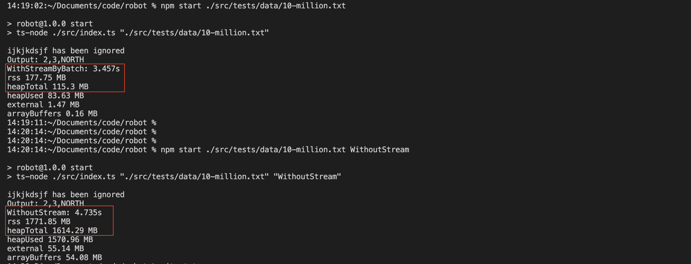

# Robot Test
A project written in TS, running on Nodejs.
# Getting started
### Prerequisites

- [node](https://nodejs.org/en/), Run ` node --version` in terminal to verify
- npm comes with node
 

## Installation

Clone the repository
```shell
$ git clone https://github.com/dontcry2013/robot.git
$ cd robot
```


### Run JEST Tests

- Run `npm install` to install package dependencies.
- Run `npm test` to run tests

### Run Robot Simulation
- Run `npm install` to install package dependencies.
- Run `npm run simulation` to start robot simulation. This will run examples:
  - **simulation-1**
  - **simulation-2**
  - **simulation-3**
  - **simulation-4**

  *Note: simulation-1, simulation-2, simulation-3, simulation-4 are test command files in `src/tests/data` folder. You can modify the commands inside these files to test different outcomes.*

- Run `npm start` *./any-command-file*.
  
  Example:
  ```
  npm start ./src/tests/data/simulation-4
  ```

  *Note: You can also create your own command file*

- Run `npm run build` to compile Typescript files to Javascript files to dist/ with 

### Run Robot in other ways
- Default will run the project with Nodejs Stream and command executed in batch.
```
npm start ./src/tests/data/simulation-4
```
- Run with `WithStream`, run the project with Nodejs Stream, but without batch.
```
npm start ./src/tests/data/simulation-4 WithStream
```
- Run with `WithoutStream`, run the project by reading all the commands to the memory.

```
npm start ./src/tests/data/simulation-4 WithoutStream
```

### Test with 10 million commands


